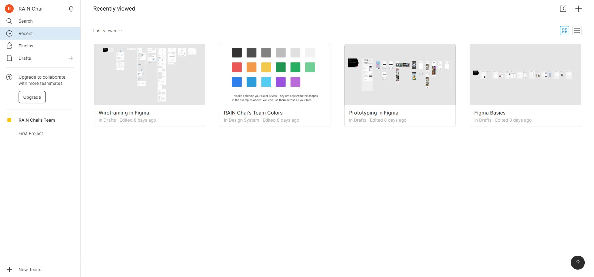

  

<h3 align="center">Sunway Tech Club Figma Workshop</h3>

Get the slides [here](./slides.html) or check it out online [here](https://slides.com/sunwaytechclub/deck-f34b86)!

## Table of Contents 📝

- [About](#about)
- [Getting Started](#getting_started)
- [Tutorial](#tutorial)

## About Figma 🧐 

> Simply, Figma is a digital design and prototyping tool. It is a UI and UX design application that you can use it to create websites, apps, or smaller user interface components that can be integrated into other projects

[https://designshack.net/articles/software/what-is-figma-intro/](https://designshack.net/articles/software/what-is-figma-intro/)

## Getting Started 🏁 

### Prerequisites

You can use Figma in two ways: in web browser or download it as [desktop app](https://www.figma.com/downloads/)

In this session, we will go with the web browser version, thou, in future you might want to use the desktop version for convenience sake.

### Getting an account

Simply go to [figma.com](https://www.figma.com/) to sign up for an account!

You should see this UI when you successfully created an account

### The interface

#### Sidebar

On your left, this is where you can navigate between the sections.

- Search: You can search anything here (board, user, etc...)
- Recent: Your recent opened board will be shown here
- Plugins: You can install plugin here! Strongly recommend [HTML to Figma](https://www.figma.com/community/plugin/747985167520967365/HTML-To-Figma) thou
- Drafts: Your own draft will be shown here, we will be using this later!

#### Import and create

Click Drafts / Recent, on your top right border, you should be able to see this, when you hover on it, you should see "Import" and "Create" tooltips

- Import: You can import figma file here, remember this! We will use this later!
- Create: You can create a new draft using this button!

Now you have everything ready! Let's get started 🎉

## Tutorial 🎈 

In summary, Figma focuses on these 5 features as of 2020:

1. Design - Draw your UI!
2. Prototyping - Make navigation!
3. Collaboration - Google-docs-style editing with your friends!
4. Design Systems - Manage all the assets you created
5. Plugin - Power-up with external functionality!

----

In this tutorial, we will focus on design and prototyping, feel free to explore other features!

Firstly, create a new draft:

Click the plus button on your sidebar.

You should see this page

On your left side of the navbar

- File - Open file, edit settings here
- Move tools - Switch between move mode and scale mode
- Frame - Create new frame (desktop, mobile, custom...)
- Shape - Create new shape
- Pen - Create custom shape
- Text - Create text
- Hand tool - A tool for you to pan around
- Comment - Add comment for communication

On your right side of the navbar

- Avatar - you!
- Share - Click this to share this figma draft to your friends!
- Present - To present your prototype
- Zoom

---

Let's start focusing on the first and the most important feature for Figma --- Design!

Before we design an interface, we will need to set the screen size, is it a design for desktop? Mobile phone? Or tablet?

In order to do this, we can use the **frame** tool.

Click the # button (third one from the left)

You can see there are different type of frames that you can use! (You can even use figma to design for your social media post!)

We will choose **iPhone 8** frame for now, click the Phone accordion and click iPhone 8.

Now, you have successfully created a frame! Congrats 🎉! Take a coffee break!

If I still have your attention, we can continue to the next step!

---
