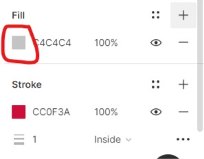
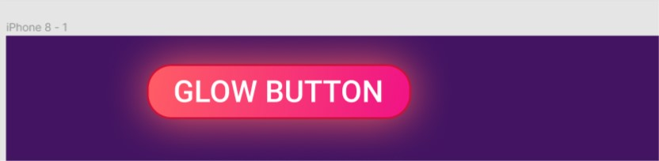
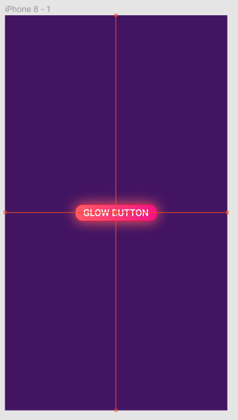

  

<h3 align="center">Sunway Tech Club Figma Workshop</h3>

Get the slides [here](./slides.html) or check it out online [here](https://slides.com/sunwaytechclub/deck-f34b86)!

## Table of Contents 📝

- [About](#about)
- [Getting Started](#getting_started)
- [Tutorial](#tutorial)

## About Figma 🧐 

> Simply, Figma is a digital design and prototyping tool. It is a UI and UX design application that you can use it to create websites, apps, or smaller user interface components that can be integrated into other projects

[https://designshack.net/articles/software/what-is-figma-intro/](https://designshack.net/articles/software/what-is-figma-intro/)

## Getting Started 🏁 

### Prerequisites

You can use Figma in two ways: in web browser or download it as [desktop app](https://www.figma.com/downloads/)

In this session, we will go with the web browser version, thou, in future you might want to use the desktop version for convenience sake.

### Getting an account

Simply go to [figma.com](https://www.figma.com/) to sign up for an account!

You should see this UI when you successfully created an account

### The interface

#### Sidebar

On your left, this is where you can navigate between the sections.

- Search: You can search anything here (board, user, etc...)
- Recent: Your recent opened board will be shown here
- Plugins: You can install plugin here! Strongly recommend [HTML to Figma](https://www.figma.com/community/plugin/747985167520967365/HTML-To-Figma) thou
- Drafts: Your own draft will be shown here, we will be using this later!

#### Import and create

Click Drafts / Recent, on your top right border, you should be able to see this, when you hover on it, you should see "Import" and "Create" tooltips

- Import: You can import figma file here, remember this! We will use this later!
- Create: You can create a new draft using this button!

Now you have everything ready! Let's get started 🎉

## Tutorial 🎈 

In summary, Figma focuses on these 5 features as of 2020:

1. Design - Draw your UI!
2. Prototyping - Make navigation!
3. Collaboration - Google-docs-style editing with your friends!
4. Design Systems - Manage all the assets you created
5. Plugin - Power-up with external functionality!

----

## Figma UI

In this tutorial, we will focus on design and prototyping, feel free to explore other features!

Firstly, create a new draft:

Click the `plus button` on your sidebar.

You should see this page

On your left side of the navbar

- File - Open file, edit settings here
- Move tools - Switch between move mode and scale mode
- Frame - Create new frame (desktop, mobile, custom...)
- Shape - Create new shape
- Pen - Create custom shape
- Text - Create text
- Hand tool - A tool for you to pan around
- Comment - Add comment for communication

On your right side of the navbar

- Avatar - you!
- Share - Click this to share this figma draft to your friends!
- Present - To present your prototype
- Zoom

---

## Design

Let's start focusing on the first and the most important feature for Figma --- Design!

Before we design an interface, we will need to set the screen size, is it a design for desktop? Mobile phone? Or tablet?

In order to do this, we can use the **frame** tool.

Click the `# button` (third one from the left)

On your right panel, you can see there are different type of frames that you can use! (You can even use figma to design for your social media post!)

We will choose **iPhone 8** frame for now, click the Phone accordion and click iPhone 8.

Now, you have successfully created a frame! Congrats 🎉! Take a coffee break!

If I still have your attention, we can continue to the next step!

---

### A simple button

Let's start by creating a simple button

Same flow, this time we choose the `fourth button` (rectangle, `r for hotkey`)

Click and drag in your iPhone frame!

You should ensure that the rectangle is inside the iPhone, to verify, check the tree structure on your left panel

It should be a child element of the iPhone frame.

---

### Frame

You might be wondering, why do we need frame? We can just draw a rectangle with white background, and it should achieve the same look right?

Well, the reason is simple, by using frame, it gives you extra functionality [like Layout Grids, Auto Layout, Constraints, and Prototyping](https://help.figma.com/hc/en-us/articles/360041539473-Frames-in-Figma)!

---

### Properties

Now let's zoom in to look at a more detail view, you can do this by holding `ctrl + scroll wheel` (or `ctrl and +`)

use Hand tool (`hotkey H`) to pan around, or `press the scroll wheel` works too.

let's start by creating a simple button!

1. Type `T for text` (or the sixth button on the top left navbar), place it on top of the button like this

2. The background color of the button is not really good, let's change it to blue!

Click the rectangle, and your right panel should look like this

Click the fill section, change the hex color to `007bff`.

Change the text color to `FFFFFF` too (remember to click the text)!

Almost there!

3. Our target is to make a button that looks like a button from [bootstrap](https://getbootstrap.com/docs/4.5/components/buttons/)

We are still missing something... the border radius!

Now, click the blue rectangle, on your right panel, you should see all the values that you can change

We are looking for the border radius, you can change this by adjusting the value of the corner icon, let's change it to `5` (feel free to try out adjusting other values too)!

4. We made it! 🎉

The design does not look exactly the same, but I will left that as a challenge for you --- try to create other buttons as well!

---

### A Fancy Button

To recap, what we had done so far:

1. Create a button using the shape tool
2. Change the button background and border radius
3. Use the text tool

What if we want to have a cool-looking design like this

> credit: https://uicookies.com/css-glow-effects/

In order to do this, we need:

1. Purple background (`#431462`)
2. Button border color (`#CC0F3A`)
3. Button background color (`#FF5E65` and `#F01286`)

Let's make it!

1. So firstly, let's change our iPhone background to purple!

- Click the iPhone element on your left panel,
you should see the border of the iPhone become blue (highlighted),
- change the fill color into purple `#431462`!

2. Create a button, use the rectangle tool and text tool

- rectangle width: 139
- rectangle height: 29
- font size: 16

3. this will be the output so far

  

4. Let's change the styling of the rectangle

  

- Click the + button for the stroke

- change the fill to `CC0F3A`

- You should now see the red border!

5. change the border radius of the button to `13`
6. Here comes the magic --- we need to use Linear effect on our rectangle background

- Click on the square color icon, you should see a panel pop up

- Click the `solid` dropdown button and choose `linear`

Almost there! Don't give up! ☕ take a coffee break if you will!

- Click and drag the white dot on top of your rectangle, drag it to the top left border of your rectangle.
- Do the same for the bottom white dot, drag to bottom right.

- To ensure you are selecting the correct one, click the top left square color icon of the button(just like the image shown above, it should be highlighted)

- Change the color to `FF5E65`
- Click the square color icon on the bottom right of the rectangle, change the color to `F01286`
- Ensure the opacity is set to max

Current progress

- Change the text color to white, and font weight to medium (Roboto font)

- Lastly, we need to apply to drop shadow effect!
- Click on the rectangle again, on your right panel, scroll down and find for `effect`, click the + button again

- You should see it applies the drop shadow effect by default, feel free to click the dropdown button and change to other! But for now we will want to achieve the similar effect from the image.

- apply the below values

- Result!

🥳 Congrats, you reach another milestone! Are you ready to take the next challenge?

There are a lot of other cool buttons [here](https://uicookies.com/css-glow-effects/), try to copy the design and practice! Google and us are your best friends when you encountered any problem, feel free to ask us!

### Grouping, Layout

We had learned how to create a button, adjust properties and apply cool effects, let's learn how we can group them to ease our work!

You may realized if you want to move the button, it is tedious to highlight everything and move...

Fret not! Just highlight them and press `ctrl + g` (or right click and choose "group")!

Now, we are able to move them around like a boss 😎

Let's move it to the middle of the iPhone, simply drag it to the middle, Figma has a built-in alignment feature to let you clip it to the middle (do zoom out, `ctrl + scroll wheel` if you find it's too zoom in)

Let's rename our button to a better name rather than just `group - 1`!

You can do this by clicking the button, and press `ctrl + r` (or go to the button element on your left panel, right click to find "rename")

I will left the iPhone element for you to rename!

psst: click the `Untitled` in the middle of the navbar to rename the draft too!

🥳🥳🥳🥳🥳 That sums up our design part of this tutorial! Congrats!

---
